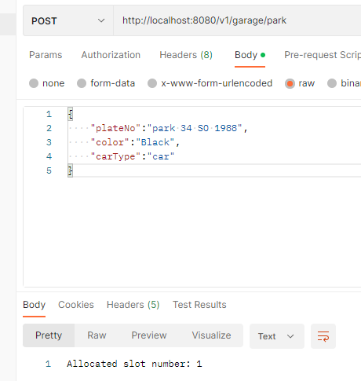
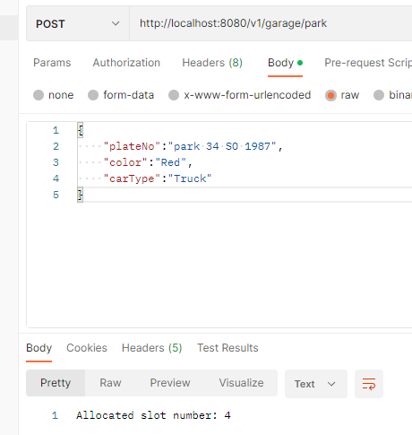
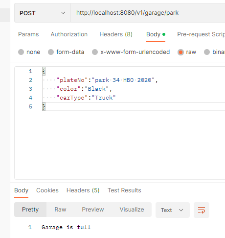
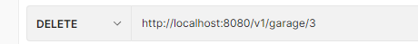
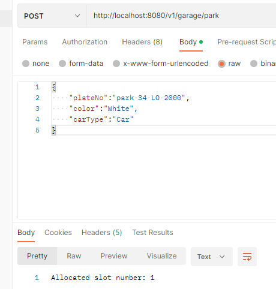
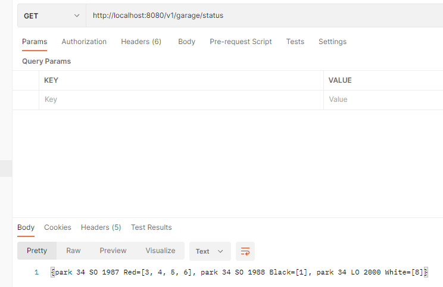

# garage-app

In this problem, you have a garage that can be parked up to 10 slots (you can consider each slot is 1 unit range) at any given point in time. 
You should create an automated ticketing system that allows your customers to use your garage without human intervention. When a car enters your garage, 
you give a unique ticket issued to the driver. The ticket issuing process includes us documenting the plate and the colour of the car and allocating an available 
slots to the car before actually handing over a ticket to the driver. When a vehicle holds number of slots with its own width, 
you have to leave 1 unit slot to next one. The customer should be allocated slot(s) which is nearest to the entry. 
At the exit the customer returns the ticket which then marks slot(s) they were using as being available.

Note: Car holds 1 slot
Jeep holds 2 slots
Truck holds 4 slots

Sample Input 1 
park 34-SO-1988 Black Car 
park 34-BO-1987 Red Truck 
park 34-VO-2018 Blue Jeep 
park 34-HBO-2020 Black Truck 
leave 3 
park 34-LO-2000 White Car 
status 

Sample Output 1 
Allocated 1 slot. 
Allocated 4 slots. 
Allocated 2 slots. 
Garage is full. 
Allocated 1 slot. 
Status: 
34 SO 1998 Black [1]
34 BO 1987 Red [3,4,5,6]
34 LO 2000 Black [8]

 
 
 
 
 

